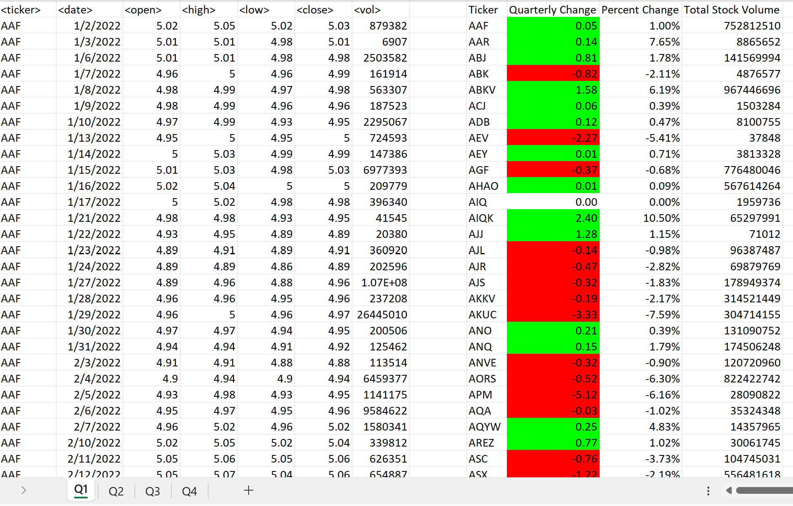

## VBA-Challenge

### VBA scripting to analyze generated stock market data. 

*This VBA analysis is done in partial fulfillment of the requirments of the University of Oregon's Data Analytics and Visualization Bootcamp.*

*Data for this dataset was generated by edX Boot Camps LLC, and is intended for educational purposes only.*

### Steps folowed:

A script that loops through all the stocks for each quarter was created to output the following information:

1. The ticker symbol
2. Quarterly change from the opening price at the beginning of a given quarter to the closing price at the end of that quarter
3. The percentage change from the opening price at the beginning of a given quarter to the closing price at the end of that quarter
4. The total stock volume of the stock

The results are depicted in the following picture. 

Then, a functionality was added to the script to return the stock with the "Greatest % increase", "Greatest % decrease", and "Greatest total volume".

The results are depicted in the following picture. 

A conditional formatting that will highlight positive change in green and negative change in red was applied. 

Finally, an adjustments was added to the VBA script to enable it to run on every worksheet (that is, every quarter) at once. 

### References used in the analysis:
* https://learn.microsoft.com/en-us/office/vba/api/excel.range.autofit - to auto-format the columns for the new output/summary table to fit with a resized coulumn.
* for this specific code (LastRow = ws.Cells(ws.Rows.Count, 1).End(xlUp).Row) , the solved star_counter_with_VBA_solution workbook provided for the VBA part of the course was used.
* https://learn.microsoft.com/en-us/office/vba/language/reference/user-interface-help/rgb-function - the required task was to use conditional formatting that will highlight positive change in green and negative change in red. Conditional Formatting based on the quarterly changes usig the RGB Function as shown in the microsoft website was employed.
* https://learn.microsoft.com/en-us/office/vba/api/excel.range.numberformat - the provided image for the challenge showed that the values of the percent change follow the format "0.00%". To match the format, the Range.NumberFormat property is used from the microsoft website with minor tweaks to match the need for this dataset.
